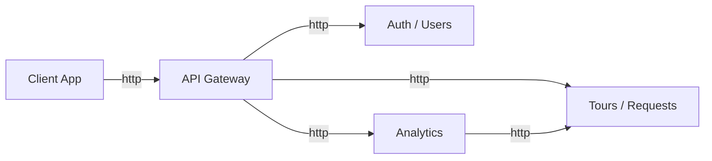
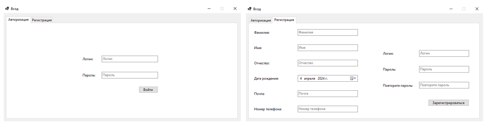
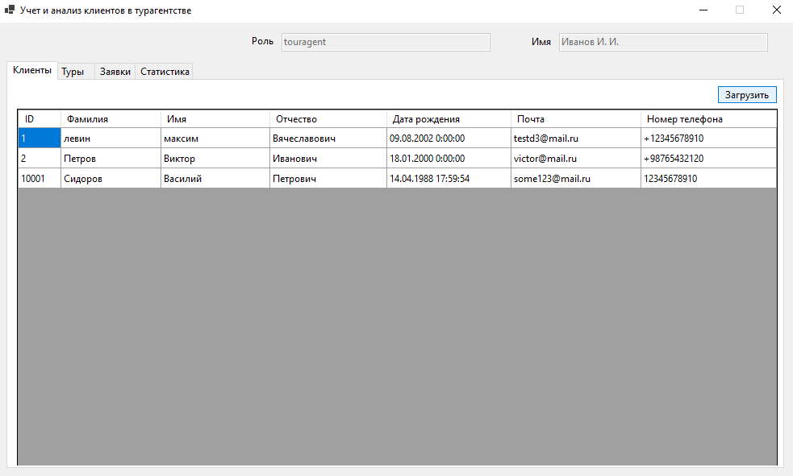
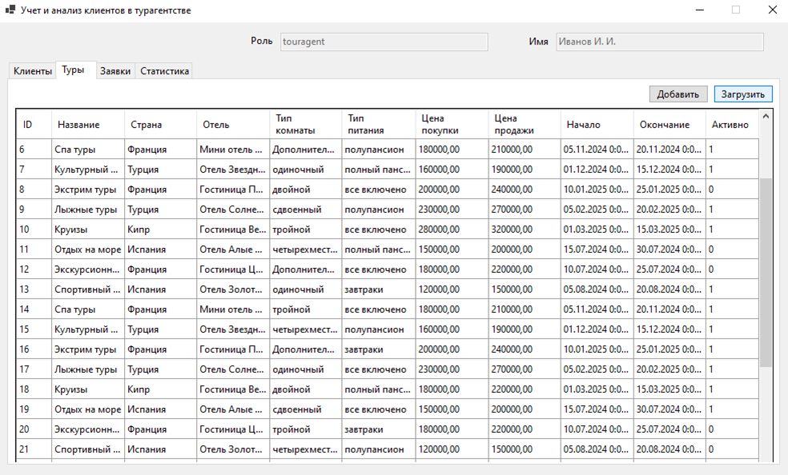
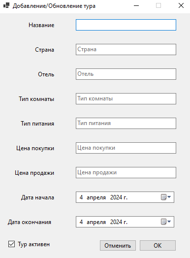
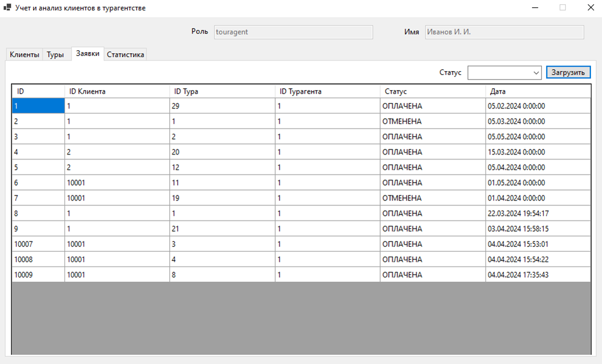
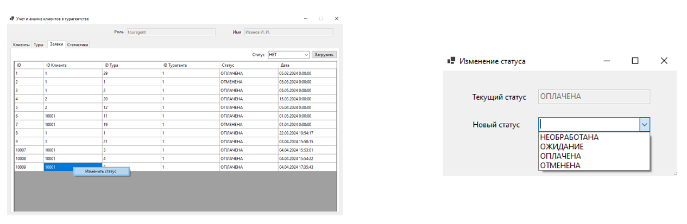
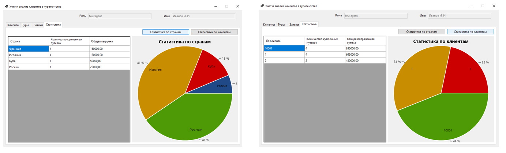
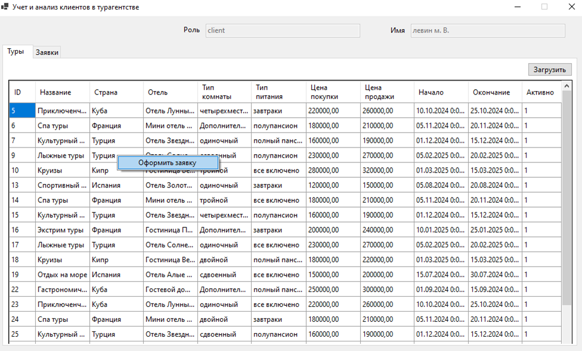
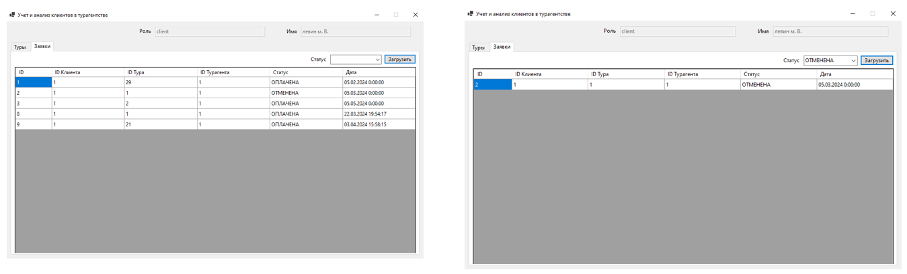

# Схема приложения

# Описание компонентов
| name    | description| Details |
|---------|------------|---------|
| Client App | клиентское приложение (GUI) | Windows Form |
| API Gateway | микросервис, к которому обращается клиентское приложения | ASP.NET + Ocelot | 
| Auth / Users | сервис регистрации/авторизация + хранение информации о пользователях | ASP.NET + JWT + EF|
| Tours / Requests | сервис хранения туров и заявок на эти туры | ASP.NET + JWT + EF|
| Analytics | сервис аналитики | ASP.NET + JWT|

# Роли
| name    | description |
|-------|-------------|
| client | клиент |
| touragent | турагент |

# API Gateway
## auth (Auth / Users)
| method  | uri                                      | roles       | description|
|-------|:-----------------------------------------|:-----------:|------------|
| POST    | api/registrate                           | any         | регистрация клиента
| POST    | api/auth                                 | any         | авторизация клиента

## clients (Auth / Users)
| method  | uri                                      | roles       | description|
|-------|:-----------------------------------------|:-----------:|------------|
| GET     | api/clients                              | touragent   | получить всех клиентов
| GET     | api/clients/{client_id}                  | touragent   | получить клиента по ID
| GET     | api/clients/me                           | client      | получить инфу о себе
| GET  | api/touragents/me                           | touragent      | получить инфу о себе (турагент)

## tours (Tours / Requests)
| method  | uri                                      | roles       | description|
|-------|:-----------------------------------------|:-----------:|------------|
| GET     | api/tours                                | any         | получить все туры
| GET     | api/tours/{tour_id}                      | any         | получить тур по ID
| POST    | api/tours                                | touragent   | добавить новый тур
| UPDATE  | api/tours/{tour_id}                      | touragent   | обновить данные о туре
| DELETE  | api/tours/{tour_id}                      | touragent   | удалить тур

## requests (Tours / Requests)
| method  | uri                                      | roles       | description|
|-------|:-----------------------------------------|:-----------:|------------|
| GET     | api/requests/me?status={status}          | client      | получить все СВОИ заявки с определенным статусом
| GET     | api/requests?status={status}             | touragent   | получить все заявки с определенным статусом
| GET     | api/requests/{client_id}?status={status} | touragent   | получить все заявки клиента по ID с определенным статусом
| POST    | api/requests                             | client      | создать заявку на тур
| POST    | api/requests/change_status               | touragent   | изменить статус заявки

## analytics (Analytics)
| method  | uri                                      | roles       | description|
|-------|:-----------------------------------------|:-----------:|------------|
| GET     | api/analytics/client_stats                    | touragent   | статистика по количеству купленных туров и общей потраченной сумме для каждого клиента
| GET     | api/analytics/top_country                  | touragent   | статистика по количеству купленных туров и общей потраченной сумме в каждой из стран

# Пример аналитики
## api/analytics/client_stats
| client_id | total_paid_tours | total_money_spent |
|:---:|:---:|:---:|
| 1 | 4 | 280000 |
| 2 | 3 | 185000 |
| ... |  |  |
| 18 | 1 | 105000 |

## api/analytics/top_country
| country | total_paid_tours | total_profit |
|:---:|:---:|:---:|
| Испания | 30 | 675000 |
| Турция | 19 | 229000 |
| ... |  |  |
| Эстония | 4 | 50000 |

# Десктопное приложение
## Форма входа

## Клиенты

## Туры

## Добавление тура

## Заявки

## Изменение статуса заявки

## Статистика

## Туры (клиент)

## Заявки (клиент)
